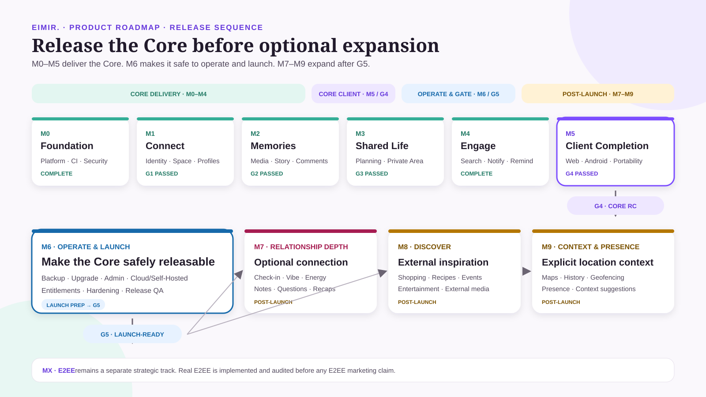
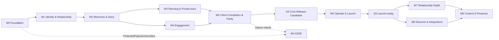

# eimir. Roadmap

**Status:** Human-readable orientation and prioritization view  
**Version:** 2.3  
**As of:** September 1, 2026  
**Time model:** phases and Release Gates, no committed calendar dates

This roadmap translates the binding product requirements into an understandable sequence. It shows goals, dependencies, and release points. Actual implementation state is tracked in [Implementation Status](./IMPLEMENTATION-STATUS.md); rules for living status sources are defined in [Status Sources and Drift Rules](./STATUS-SOURCES.md).

The accepted sequencing decision is [ADR 0006 — Release the Core before optional product expansion](./decisions/0006-release-before-optional-expansion.md). It changes only the **forward M6-M9 ordering**. M0-M4 remain historical milestones and M5 remains Client Completion & Parity.

## Roadmap at a glance



**Current:** M0 through M5 are complete for their intended scope. **G1, G2, G3, and G4 have passed.** **M6 — Operate & Launch** is the next milestone; G5 has not yet been evaluated or passed.

The intended forward path is now deliberately:

```text
Core Domain complete
        ↓
M5 Client Completion & Parity
        ↓
G4 Core Release Candidate
        ↓
M6 Operate & Launch
        ↓
G5 Launch-ready
        ↓
M7 Relationship Depth
        ↓
M8 Discover & Integrations
        ↓
M9 Context & Presence
```

Optional relationship, integration, and location features are therefore **not prerequisites for the first safe release**.

## Document roles

| Document | Answers |
|---|---|
| this Roadmap | Where are we going, in which order, and why? |
| [Implementation Status](./IMPLEMENTATION-STATUS.md) | What is actually implemented on `main`, and what remains open? |
| [Status Sources and Drift Rules](./STATUS-SOURCES.md) | Which status files are living documents and which are historical snapshots? |
| [ADR 0006](./decisions/0006-release-before-optional-expansion.md) | Why did M6-M9 change order and what exactly was superseded? |
| [M2 Project Control](./m2/PROJECT-CONTROL.md) | Which M2/M5 boundaries and G2 criteria applied? |
| [M3 Technical Readiness Package](./m3/README.md) | Which M3 decisions, delivery rules, and runtime results apply? |
| [M3 G3 Evidence Map](./m3/G3-EVIDENCE.md) | Which executable HTTP/PostgreSQL/race tests constitute the G3 evidence set? |
| [M4 Evidence Map](./m4/M4-EVIDENCE.md) | Which M4 runtime slices and evidence complete M4? |
| dated reviews under `docs/reviews/` | Historical gate/review snapshots; never rewritten retroactively |
| GitHub Issues/PRs | Which concrete work packages are being handled? |
| [Product Reference v1](./product/design/README.md) | Which product-design direction is binding, and how are older references classified? |
| [Design remediation roadmap](./product/design/implementation-roadmap.md) | Which #955 foundation/reference/propagation slices implement the accepted direction? This does not renumber M0–M9 or replace release gates. |
| [Product Specification](../specification/PRODUCT-SPEC.md) | Current compact binding product requirements and milestone mapping |
| [Master Specification](../specification/CLEAN-ROOM-MASTER-SPEC.md) | Binding Clean-Room, security, Privacy, Domain, architecture and technical requirements |

### Specification precedence after ADR 0006

The Master Specification remains authoritative for Clean-Room, Security, Privacy, Domain modeling, architecture, tests, operations principles and technical requirements.

For **milestone numbering/order only**, Product Spec 1.1 and ADR 0006 supersede the old M6-M9 sequence in section 68 of the current Master Specification until that document is next consolidated. No other Master Specification rule is weakened.

## Current milestone snapshot

### M0 — Foundation: complete

API/DB conventions, migrations, Outbox, jobs, MediaStore foundation, ProtectedPayload boundary, versioned OpenAPI, PostgreSQL integration tests, Supply Chain checks, Secret Scan, and Provenance are present for the Foundation scope.

### M1 — Identity & Relationship: complete, G1 passed

Account/AuthIdentity, Sessions, Space/Membership/Tenant Guard, Invitations, Profile, RelatedPerson/ImportantDate, OIDC, Passkeys, Magic Link, email verification, and Recovery are delivered. Repository and Pre-Exposure hardening already completed in this historical scope remain valid.

### M2 — Memories / Story Alpha: complete, G2 passed

Memory, image Attachments, HeartMoment Privacy, Milestones, Comments, Story, MediaStore integration and thin real Web/Android reference flows are delivered. The [final G2 Gate Review](./reviews/2026-08-26-g2-final-gate-review.md) remains the immutable G2 decision.

Video remains separate future work and is not implied by M2 completion.

### M3 — Planning & Private Area: complete, G3 passed

Wishes, Plans, Places, typed relations, Chapters, shared Collections and the owner-only Private Area are delivered with their Privacy/concurrency/evidence package. The [final G3 Gate Review](./reviews/2026-08-30-g3-gate-review.md) remains the immutable G3 decision.

### M4 — Engage: complete

Search/Dashboard, Activity/Notifications, Thinking-of-you/PushDelivery, Reminders, Rules and occurrence planning are delivered. Full Web/Android productization of these contracts was M5's scope and is complete.

### M5 — Client Completion & Parity: complete, G4 passed

M5 turned the already delivered M0-M4 Core into a complete product on both clients. The binding decision source is the [G4 Gate Review](./reviews/2026-09-03-g4-gate-review.md). It owned:

- complete Web productization;
- complete Android productization;
- stable route/Deep Link behavior;
- versioned Export/Import;
- bounded Read Cache/offline-read behavior;
- systematic domain parity;
- Accessibility;
- final Core client Privacy/Security evidence.

**2026-09-02 gate scope decision:** dedicated Performance evidence and manual Accessibility acceptance are deprioritized for G4 (see `docs/IMPLEMENTATION-STATUS.md`); the existing per-PR Cross-Cutting Quality review and per-slice automated Accessibility semantics stand as the accepted evidence instead. Domain parity is produced as a pragmatic Web/Android feature audit — closing or explicitly accepting real gaps — rather than a formal evidence document.

**Parity audit outcome:** the audit ran on 2026-09-02 and is recorded on #295. Its six findings (#603-#608) were all closed rather than accepted. Android registers no OS-level App Link yet; that boundary stays declared under the S6 decision rather than counted as satisfied.

**Scope protection:** M5 did not absorb new Relationship Depth domains. New Vibe/Energy, Love Note, achievement, Question or Recap runtime belongs to M7 after G5. M5 provided reusable navigation/settings/client primitives without inventing those new Domain contracts.

## Forward milestones

| Phase | Human goal | Scope | Outcome |
|---|---|---|---|
| **M5 · Client Completion & Parity** | Web and Android are fully usable | complete client integration, Export/Import, Read Cache, Deep Links, Accessibility, parity audit | **G4 Core Release Candidate** |
| **M6 · Operate & Launch** | the Core can be safely operated and released | Self-Hosted, Cloud/Managed, Backup/Restore/Upgrade, administration, observability, Entitlements/Billing adapters, hardening, release engineering and final launch QA | **G5 Launch-ready** |
| **M7 · Relationship Depth** | deepen everyday connection without making it mandatory | module configuration, Daily Check-in/Vibe/Energy, partner notes/support gestures, Questions, shared achievements, monthly/yearly recaps | optional post-launch relationship depth |
| **M8 · Discover & Integrations** | bring optional external inspiration into the product | Shopping, Recipes, Events/Entertainment, external media and provider adapters | integrations without Core dependency |
| **M9 · Context & Presence** | add explicit, privacy-sensitive context only when enabled | Maps/location history, opt-in location context, Geofencing, Presence, contextual suggestions | separately consented context features |
| **MX · E2EE** | real cryptographic protection | key model, migration, client crypto, Recovery | separately evaluated E2EE version |

## M6 — Operate & Launch

M6 is now the launch-readiness milestone and follows G4 directly.

Its readiness/delivery plan should separate at least these risk classes rather than building one monolithic release PR:

1. **Release engineering** — final application identity/versioning/signing, reproducible release artifacts, release provenance/SBOM where applicable.
2. **Operations** — Backup/Restore/Upgrade, retention/cleanup, recovery evidence, failure handling.
3. **Deployment** — Self-Hosted, persistent development/staging, promotion/rollback, Cloud/Managed deployment.
4. **Administration** — runtime registration/maintenance controls and ServerAdmin surfaces.
5. **Commercial capability runtime** — centralized Entitlement/capability model plus provider-neutral billing/licensing adapters consistent with #262.
6. **Release QA** — Security, Privacy, Accessibility, performance, incident and recovery evidence.

Existing issues such as #190, #192, #193, #194, #304, #334 and #335 should be classified against these M6 concerns when the detailed M6 package is assembled. Reclassification does not silently expand their issue scope.

## M7 — Relationship Depth

M7 owns optional everyday relationship features. It starts with readiness rather than immediately adding independent domains.

### M7-S0 — Module and Daily Check-in foundation

#432 is the conceptual owner for the Space-level optional-module boundary.

Effective availability must preserve separate concerns:

```text
server/deployment capability
        ∩
commercial entitlement capability
        ∩
Space module configuration
        ∩
personal preference/consent where required
        =
effective product capability
```

Consequences:

- a Space setting cannot unlock a Premium capability without Entitlement;
- an Entitlement cannot force a deliberately disabled optional module to appear;
- Security, Privacy, Accessibility and essential data rights are never optional Space modules;
- disabling a module does not delete its data;
- personal/emotional sharing remains voluntary even when the module is available.

V1 may give the Space creator module-management authority. Runtime callers should consume an authoritative capability such as `canManageSpaceConfiguration`, not permanently spread direct `accountId == space.createdBy` checks across the codebase.

### One Daily Check-in foundation

#429 and #431 remain distinct product experiences but must share a coherent Daily Check-in/Privacy foundation. M7-S0 evaluates one small `DailyCheckIn` boundary with separately optional dimensions such as `vibe` and `energyLevel`; exact persistence, local-day/timezone, retention and historical-use semantics are decided before runtime.

### M7 feature families

After S0, M7 may deliver in contract-safe slices:

- Daily Vibe Check;
- Daily Energy/Capacity Check-in;
- Love Notes / partner-directed small notes;
- lightweight Support Gestures reusing Thinking-of-you where applicable;
- `Unsere Fragen` and editorial question pool;
- shared-achievement/Celebration behavior built on authoritative existing completion events where possible;
- monthly and yearly recaps.

M7 must not become a gamification, chat, health-scoring or behavioral-profiling platform.

## M8 — Discover & Integrations

M8 contains optional provider-backed product expansion that does not require continuous location context, including:

- Shopping Domain;
- Recipes;
- Events/Discovery;
- Entertainment;
- external media such as Immich-style integration;
- provider adapters needed for these capabilities.

Integrations remain replaceable behind provider boundaries and must not become Core availability dependencies.

## M9 — Context & Presence

M9 groups the privacy-sensitive location/context family so it receives one coherent opt-in, retention and disclosure model:

- Maps and map presentation;
- location history semantics, including Dawarich-style adapters where chosen;
- active location context;
- Geofencing;
- optional partner distance;
- Ephemeral Presence;
- contextual suggestions driven by explicitly enabled context.

Normal M8 provider integration must not silently activate M9-style location tracking.

## Dependencies



M7 and M8 may evolve independently after G5 where their shared foundations permit it; M9 consumes the relevant integration/provider capabilities only after its own Privacy/readiness decisions.

## Release Gates

### G0 — Foundation verifiable

**Passed.**

### G1 — Secure couple Space

**Passed.** Historical evidence remains in the dated G1 review.

### G2 — Story Alpha

**Passed.** The [final G2 Gate Review](./reviews/2026-08-26-g2-final-gate-review.md) remains the immutable decision.

### G3 — Shared everyday use

**Passed.** The [final G3 Gate Review](./reviews/2026-08-30-g3-gate-review.md) remains the immutable decision.

### G4 — Core Release Candidate

**Passed.** The [G4 Gate Review](./reviews/2026-09-03-g4-gate-review.md) remains the immutable decision.

G4 was evaluated after M5 against the following minimum:

- Web and Android are domain-equivalent for the Core, established through a
  pragmatic Web/Android parity audit rather than a formal evidence document;
- Read Cache/offline-read works without pretending Offline Write exists;
- Export/Import is versioned and tested;
- Deep Links and route identity are stable;
- Design System is verified and the per-slice automated Accessibility
  semantics (contrast, screen-reader names, focus order, touch targets) are
  delivered — manual acceptance testing is deprioritized for now, per the
  2026-09-02 gate scope decision above;
- Privacy and Security gates pass;
- no M7 domain is required merely to declare the Core client-complete.

Dedicated Performance evidence is not a separate G4 requirement; the existing
per-PR Cross-Cutting Quality review already covers query count, payload size,
and resource impact.

### G5 — Launch-ready

G5 is evaluated after **M6**, before M7-M9 expansion is required. At minimum:

- Cloud/Managed and Self-Hosted operation are documented and supported for the launch target;
- Backup/Restore/Upgrade and rollback/recovery paths are demonstrated;
- release application identity, signing/versioning and artifact pipeline are controlled;
- administration/maintenance/recovery access is safe;
- Retention and complete deletion responsibilities are resolved;
- Entitlements/Billing are centralized and do not couple payment-provider concepts into Domain code;
- monitoring/observability contains no sensitive content;
- Security/Privacy hardening and final Accessibility/performance release QA pass;
- Incident and Recovery processes are tested;
- the public/demo exposure boundary is safe.

**M7, M8 and M9 features are not G5 prerequisites.**

## Deliberately not pulled forward

- #429-#432 Relationship Depth runtime into M5;
- semantic/vector/AI Search without a separately approved later capability and Privacy model;
- Shopping, Event Discovery and external provider features before the Core is launch-ready;
- Location/Geofencing/Presence before the M9 opt-in/Privacy boundary;
- Offline Write Sync in the MVP;
- public Share Links;
- AI features;
- E2EE marketing before real implementation and review.

## Roadmap risks

| Risk | Safeguard |
|---|---|
| M5 never finishes because new product ideas keep entering it | explicit M5 Core scope protection; new Relationship Depth work starts in M7 |
| Optional expansion delays a safe first release | M6/G5 now precedes M7-M9 |
| Runtime starts before contracts are resolved | readiness/decision slices and contract-testable OpenAPI before runtime |
| Web and Android drift apart | resolved by construction since ADR 0011: Android packages the single Web product UI; the shared OpenAPI contract remains the API authority |
| Feature flags, Entitlements and user choices become one ambiguous switch | separate deployment capability, Entitlement, Space module config and personal preference |
| Privacy classes become Client Domain | clear separation of `SHARED/PRIVATE` vs. `SPACE_SHARED/OWNER_ONLY` |
| Location integrations leak into ordinary provider work | M9 owns user-visible active location/context semantics |
| Repository gates are bypassed | Pull Request, Merge Commit and required checks remain mandatory |
| public operation starts too early | G5 remains the mandatory launch gate after M6 |

## Maintenance

- Dated reviews are never rewritten retroactively.
- Completed milestone documents may retain historical milestone references when they clearly describe the state/decision at that time.
- Forward-looking living documents use the ADR 0006 sequence.
- Static supposedly current `main` SHAs are not stored as living status markers.
- Open tasks live in Implementation Status and GitHub Issues.
- Roadmap updates state the reason and impact, not merely a new sequence.

## Related documents

- [Implementation Status](./IMPLEMENTATION-STATUS.md)
- [Status Sources and Drift Rules](./STATUS-SOURCES.md)
- [ADR 0006 — Release before optional expansion](./decisions/0006-release-before-optional-expansion.md)
- [M2 Project Control](./m2/PROJECT-CONTROL.md)
- [M3 Technical Readiness Package](./m3/README.md)
- [M3 G3 Evidence Map](./m3/G3-EVIDENCE.md)
- [M4 Evidence Map](./m4/M4-EVIDENCE.md)
- [Final G3 Gate Review](./reviews/2026-08-30-g3-gate-review.md)
- [Final G2 Gate Review](./reviews/2026-08-26-g2-final-gate-review.md)
- [Product Specification](../specification/PRODUCT-SPEC.md)
- [Master Specification](../specification/CLEAN-ROOM-MASTER-SPEC.md)
