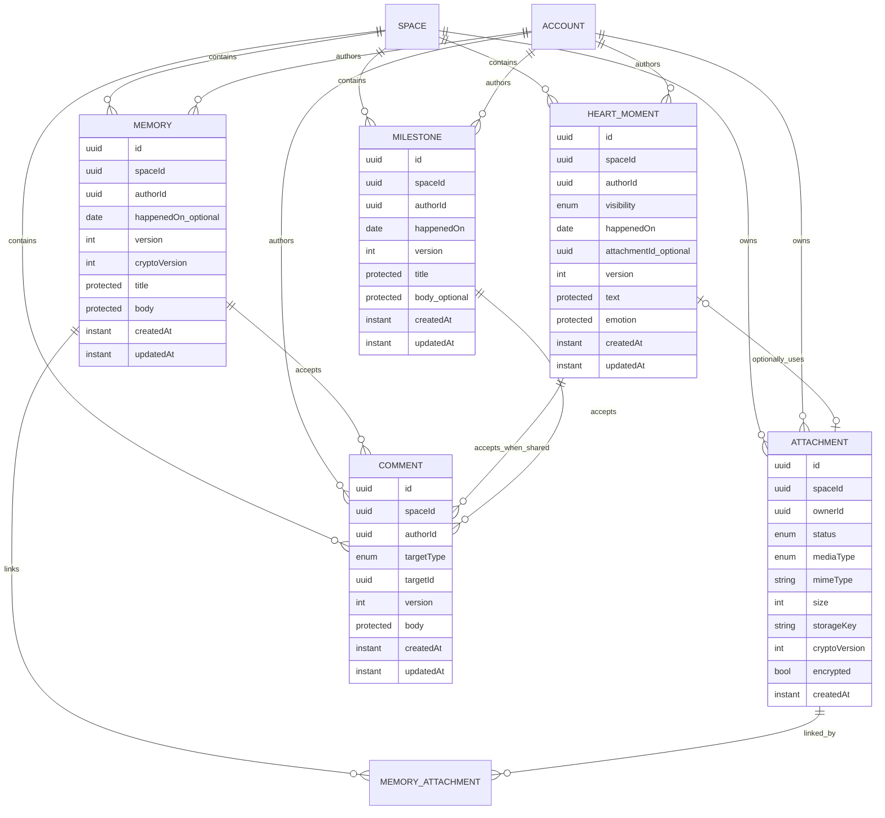

# M2 Domain Model

**Status:** binding Domain/Privacy draft after M2-S0 #68; Media/API details remain open until #69/#70  
**Version:** 1.1

## 1. Model overview



`MEMORY_ATTACHMENT` is a technical relation sketch because Memories can contain multiple Media items. Its name and concrete persistence form remain an open decision until #69; a generic universal relation is not intended.

## 2. Visibility terminology

Public Domain/API language and internal Authorization language are deliberately separated:

| Layer | Values | Contract |
|---|---|---|
| Domain/API | `SHARED`, `PRIVATE` | domain visibility; client value |
| Authorization/persistence | `SPACE_SHARED`, `OWNER_ONLY` | internal access class; not writable as a redundant client value |

`PRIVATE` maps server-side to `OWNER_ONLY`, and `SHARED` maps to `SPACE_SHARED`. Resources that are always shared at the domain level (Memory, Milestone) do not need a freely writable visibility field. This separation prevents competing sources of truth.

## 3. Domain contracts

### Memory

| Aspect | Contract |
|---|---|
| Privacy | shared Space content; internally `SPACE_SHARED` |
| Author | derived from Authorization Context on Create; immutable afterward |
| Content | `title`, `body` within the ProtectedPayload boundary |
| Date | optional `happenedOn`, separate from `createdAt` |
| Media | multiple Attachments; relation remains non-binding until #69 |
| Write | author only; partner gains no Update/Delete authority from shared readability |
| Read | both active Space partners |
| Story | always permitted unless deleted |
| Search | global full-text Search is not required for G2; M4 scope |
| Concurrency | `version`, 409 for stale Update/Delete |

Non-content fields are subject to the same author rule. Later collaborative editing would be a new Domain feature, not a silent weakening of this invariant.

### HeartMoment

| Aspect | Contract |
|---|---|
| Privacy | Domain `PRIVATE` → internally `OWNER_ONLY`; Domain `SHARED` → internally `SPACE_SHARED` |
| Required fields | text, emotion, visibility, `happenedOn` |
| Emotions | `LOVED`, `SEEN`, `APPRECIATED`, `SUPPORTED`, `GRATEFUL`, `HAPPY` |
| Emotion classification | ProtectedPayload; not Analytics/Event/Log metadata |
| Media | at most one optional Attachment according to the current model; Media contract #69 |
| Comments | `SHARED` only; delete atomically on `SHARED -> PRIVATE` |
| Story | own Timeline always (own position, real `visibility`); partner's Timeline only when `SHARED` (#1021, superseding M2-D22) |
| Partner access when PRIVATE | never — including indirectly |
| Concurrency | `version`, 409 for stale Update/Delete/Privacy transition |

A Privacy transition is a Domain operation, not merely client presentation. `PRIVATE` must not first be loaded and then filtered out in the client. `SHARED -> PRIVATE` changes the internal class and deletes existing Comments in the same DB transaction; `PRIVATE -> SHARED` does not restore them.

### Milestone

| Aspect | Contract |
|---|---|
| Privacy | shared Space content, internally `SPACE_SHARED` |
| Model | dedicated entity, not a special List type |
| Required fields | Title, `happenedOn`, author |
| Optional | Body |
| Author | immutable |
| Story | yes |
| Comments | yes |
| Later use | Chapter, Search, Year Recap |
| Concurrency | `version` |

The partner write rule is decided by M2-D25: both partners can read, while Update and Delete remain with the immutable author — the same rule as for Memory. Shared readability does not grant write authority. Later collaborative editing requires a new decision and a dedicated rule in `authorization.rules`, not an endpoint exception.

### Attachment

| Aspect | Contract |
|---|---|
| Ownership | exactly one `spaceId`, exactly one `ownerId` |
| Lifecycle | `PENDING → upload → validation → READY`, failure `FAILED`; details #69 |
| Storage | `LocalMediaStore` or `S3MediaStore` behind an interface |
| Storage Key | never derived from user filename; UUID-based Space path |
| Metadata | type, MIME, size, optional width/height/duration, original name; Privacy/Retention details #69 |
| Crypto | `cryptoVersion`, `encrypted`; Storage must not assume plaintext |
| Read | after Membership/resource Authorization through a streaming route or short-lived URL |
| Public access | never public |

Attachment Authorization follows not only the Attachment itself but also the authorized target resource. An owner-only HeartMoment must not leak its Attachment to the partner through an alternate route.

### Comment

| Aspect | Contract |
|---|---|
| Targets | controlled enum: `MEMORY`, `MILESTONE`, `HEART_MOMENT` |
| HeartMoment | only when `SHARED` |
| Privacy | inherits target-resource reachability; no independent Public/Private state |
| Author | immutable; only the author may edit/delete their own Body |
| Concurrency | persisted `version`; Update/Delete with If-Match, stale → 409 |
| Parent Delete | Comments are atomically deleted with the parent as dependent Domain objects |
| HeartMoment made private | existing Comments are atomically deleted |
| Event | Comment on another person's shared content → Domain Event without Body |
| Notification | to content author, optional Push; no unnecessary text payloads |

Server-side Parent Cascade/Privacy operations may remove dependent Comments regardless of Comment author; these are not user Edit operations and require no If-Match supplied by the Comment author.

## 4. Privacy matrix

| Resource | Author | Partner in Space | Foreign Space | Story | Search | Partner Export | Comment |
|---|---:|---:|---:|---:|---:|---:|---:|
| Memory | CRUD | Read | never | yes | later M4 | yes | yes |
| HeartMoment SHARED | CRUD | Read | never | yes | later M4 | yes | yes |
| HeartMoment PRIVATE | CRUD | never | never | owner only (#1021) | owner only, if offered later | never | never |
| Milestone | CRUD* | Read | never | yes | later M4 | yes | yes |
| Attachment on Shared target | according to target | according to target | never | through target | through target | according to target | n/a |
| Attachment on owner-only target | owner | never | never | never | never for partner | never | n/a |
| Comment | own content CRUD | read according to target | never | through target | not G2 | according to target | n/a |

`*` Milestone partner write permissions are confirmed separately before its runtime slice; until then author-only remains the safe default assumption.

"Partner in Space" means an active Membership in the same Space. Access based only on a Resource ID is never permitted.

## 5. ProtectedPayload boundary

### Metadata

- IDs and Tenant/author references,
- domain sort data such as `happenedOn`,
- technical timestamps and `version`,
- `cryptoVersion`,
- non-content states strictly required for derived behavior.

### ProtectedPayload

- Memory `title` and `body`,
- HeartMoment `text` and `emotion`,
- Milestone `title` and `body`,
- Comment `body`,
- other sensitive content fields.

Version 1 may store payloads as plaintext, but Domain, API, persistence, and Outbox boundaries must not require plaintext as a permanently necessary representation. This readiness is not real E2EE.

ProtectedPayload is not duplicated into Analytics, log fields, metric labels, Notification Previews, or Domain Event payloads. Authorized resource responses may of course return the content after successful Authorization.

## 6. Story Read Model

```text
Memory ─────────────────────┐
HeartMoment (viewer-authorized) ── StoryQueryService ── CursorPage<StoryItem>
Milestone ───────────────────┘
```

The Story query is viewer-authorized (#1021, superseding M2-D22): it applies
the same `OWNER_ONLY`/`SPACE_SHARED` Authorization rule as every other
resource, so a HeartMoment an account marked `PRIVATE` stays part of that
account's own Timeline at its ordinary position and carries its real
`visibility`, while remaining completely absent from the partner's. The
separate relationship-shared projections — the Dashboard's shared Story
counts and Discover — stay `SPACE_SHARED`-only, unaffected by this.

Story is not persisted. Each item references its original and contains only the data necessary for Timeline, author, Media preview, and navigation.

Ordering and Cursor semantics are decided by #70 / M2-D08. Global full-text Search `q` is not part of the minimum G2 requirement and generally remains M4.

## 7. Domain Events

Every M2 Event uses at least:

```text
eventId
eventType
occurredAt
spaceId
actorId
resourceType
resourceId
resourceVersion
```

Event-specific payload may contain only additional IDs, technical timestamps, and explicitly safe states/categories. Forbidden are ProtectedPayload, Comment Body, HeartMoment emotion, original filename, Storage Key, and Download URL.

| Event | Transaction | Additional safe payload | Possible consumers |
|---|---|---|---|
| `MEMORY_CREATED` | with Memory Create | no content fields | Activity, Rules |
| `MEMORY_UPDATED` | with Update | optionally changed safe categories | Cache/Activity |
| `MEMORY_DELETED` | with Delete | `deletedAt` | Attachment Cleanup, Cache |
| `HEART_MOMENT_CREATED` | with Create | visibility/Privacy state; no text/emotion | Activity/Notification only when shared |
| `HEART_MOMENT_VISIBILITY_CHANGED` | with transition | old/new visibility | cache/Notification protection |
| `MILESTONE_CREATED` | with Create | no content fields | Story/Activity |
| `COMMENT_CREATED` | with Create | target type/ID | Notification to content author |
| `ATTACHMENT_READY` | with Finalize | safe technical metadata according to #69 | Resource/Processing |
| `ATTACHMENT_FAILED` | with state change | safe error code | Cleanup/Observability |

Consumers that need presentation data load it under their own Authorization or use generic text. The Outbox is not a shadow copy of sensitive content.

## 8. Delete and reference rules

- User-initiated Updates/Deletes check the current `version` and write permission.
- Domain Delete makes the resource invisible immediately upon successful commit.
- A deleted original disappears automatically from Story; there is no Story copy.
- Comments are atomically deleted in the same DB transaction when their parent is deleted.
- On HeartMoment `SHARED -> PRIVATE`, Comments are also atomically deleted.
- Domain Events/Audit may retain technical IDs/states but no ProtectedPayload.
- Attachments/Blobs are physically deleted only according to the reference/Retention/Cleanup rules defined in #69.
- Storage deletion and the DB transaction are not coupled as one unreliable synchronous operation; Cleanup may run through Outbox/Job.
- Failed Storage Cleanup remains observable and retryable without making the deleted Domain resource visible again.

## 9. Invariants

1. Every resource carries exactly one Space context.
2. Membership is checked before resource access.
3. Owner-only is enforced in the data query.
4. A `PRIVATE` HeartMoment creates no partner Activity, Notification, or partner-visible Story row; it remains part of its owner's own Story (#1021).
5. Attachment Authorization follows the target resource.
6. Mutable entities are not overwritten without a version check.
7. Story contains only references to originals, not duplicated content.
8. Domain change and relevant Event are written atomically.
9. MediaStore and Domain remain separated through an interface.
10. No M2 structure requires or claims real E2EE.
11. Shared readability does not automatically grant write permission.
12. `authorId`/`ownerId` are not transferred by normal Updates.
13. `visibility` is the domain-level API truth; internal `privacyClass` is not a second client source of truth.
14. ProtectedPayload is not duplicated into Events, logs, Analytics, or metric labels.

## Related documents

- [API Design](./API-DESIGN.md)
- [Media Pipeline](./MEDIA-PIPELINE.md)
- [Security Test Matrix](./SECURITY-TEST-MATRIX.md)
- [Decision Log](./DECISION-LOG.md)
- [Project Control](./PROJECT-CONTROL.md)
