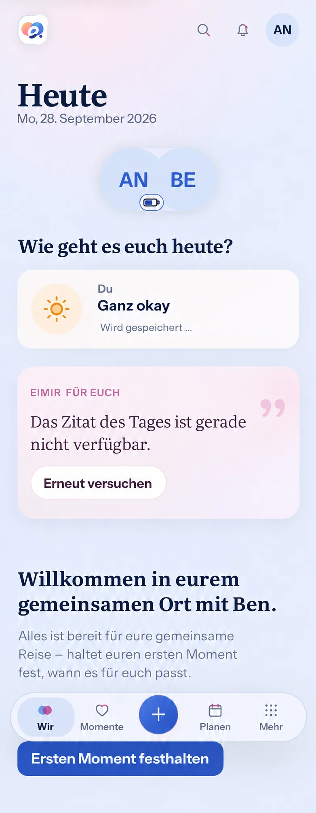

# #508 — Immediate own Vibe feedback on Today

**Baseline:** `main@876e33cfe3f48e4f19446302f4f75d571f8985b5` (2026-09-30). **Scope:** the existing Web/Mobile Web own Daily Vibe check-in on Today, one bounded slice of #508. The generated Compact reference below was produced from the actual #508 Energy browser capture at this baseline before Vibe UI implementation.

The image guides whole-screen placement, hierarchy and pending copy, not pixels or runtime proof. It includes the current header, couple avatars and Energy chip, Vibe section, quote failure/retry, welcome content, first-memory action and bottom navigation in one representative module order. Its enlarged rendering, icon and typography details are illustrative; actual eimir. assets, tokens, localization and browser screenshots govern. Other Today module orders, partner visibility, content and dark mode remain authoritative from the live UI. No generated partner feeling is a valid pending preview.

## Existing destination and relevant authority

Product Reference v1 R4/Today and Today Screen Template govern. `DailyVibeCheckIn` already offers six semantic choices and an optional note in `ShortTaskSheet`; a Save sends the shared DailyCheckIn `If-Match` update, locks repeat taps, keeps the sheet open with localized saving/error text, and only shows the own card after the server responds. The Account-and-Space query combines own Vibe/Energy with a server-authorized partner projection. `DailyEnergyCheckIn` already shows an immediate own battery value while pending. Today may also include couple presence, selected content, the quote/insights and upcoming content according to current module settings. This change does not add a new check-in surface or infer a partner state.

## Mobile Interaction Contract

| Concern | Decision |
| --- | --- |
| Human outcome | The person sees the Vibe they chose immediately after Save, without waiting for a round trip or feeling that the tap was lost. |
| Primary Compact state/action | Keep the existing Today section and `ShortTaskSheet` choices/note. Save remains the single dominant action. Close the sheet on a nonempty Save and show only the own card with the selected value and a small localized pending status. |
| Immediate vs confirmed | Pending is explicit text, not a spinner, animation or success claim. The optional note is not exposed on Today. Only a successful server response updates the shared DailyCheckIn query and clears pending; the confirmed own card remains. Do not preview an unknown partner Vibe or trigger the Mutual Reveal animation until the server-authorized response arrives. |
| Interaction and duplicate protection | Reuse the existing button, sheet, mutation and query. The own pending card remains focusable but cannot open another writer while its save is pending. Existing form controls remain locked during the request. No new navigation, gesture, typing step, provider or queue. |
| Error/retry | A failed ordinary write removes the local preview, restores the last authoritative own value, reopens the existing sheet with the exact selected Vibe/note and its inline error, and permits a deliberate Retry. A version conflict discards the preview, refetches the authoritative view and uses the existing conflict snackbar; no automatic second PATCH. Module/context errors keep their existing refresh and disabled-state behavior. |
| Offline/initial/loading | Do not start a new optimistic write offline. Existing unavailable, loading and retry states remain; never cache a pending Vibe across reloads. |
| Privacy and consistency | Keep the pending value local to this Account, Space and mounted task. Do not modify the combined query's partner projection, ETag, Energy or server-derived module state before confirmation. Cancel in-flight refetch before committing the returned snapshot so a stale GET cannot overwrite it. Partner display and reveal still depend on the authorized server response; no private note is copied into logs, URL, public cache or telemetry. |
| Narrow/large text/accessibility | Existing one-column 320–430 px layout, 44 px controls and bounded sheet remain. Pending/error text is exposed as a polite status. Closing the sheet returns focus to the own card; reopening on error focuses the existing sheet. No automatic keyboard. |
| Motion and Expanded | Reuse the existing card motion only for confirmed state, not a pending celebration. Reduced motion leaves the same text and focus feedback. Expanded preserves section order and bounded reading rhythm; no new panel or dashboard grid. |
| Return | Leaving Today during pending work does not leave a speculative Vibe in the shared cache. Returning reads the authoritative server view; generic failure keeps the draft only while this task remains mounted. |

## Reuse, business and cross-cutting decisions

Reuse TanStack Query's mutation lifecycle, existing Account-and-Space-scoped DailyCheckIn query, `If-Match`, `ShortTaskSheet`, Vibe card, semantic tokens and i18n. Alternatives considered: write an optimistic combined query projection, or hold an own-only local preview. The latter avoids fabricating a partner reveal, mutating the ETag or overwriting Energy, and needs no third-party library/provider. No new API/schema, storage, inference, component model or native capability is needed.

The matrix classifies Daily Vibe's current-day check-in as Free/Core; no entitlement, quota, Cloud/Self-Hosted, storage, cost, downgrade or export behavior changes. The server remains authoritative for privacy, module availability and conflicts. This slice has no new external data flow or retention surface. The existing partner-aware cache is not used as a speculative write target.

## Runtime acceptance plan

- Open Today with hidden partner Vibe, choose a value, Save with a held response, observe the own pending card and status but no partner reveal, release the response, observe the confirmed own card and only then an authorized partner reveal.
- Repeat with an existing own Vibe and optional note; force a server error and verify rollback, preserved draft, inline retry and exactly one PATCH per tap. Verify conflict refetch, module/context failures, offline, an intervening stale GET and Account/Space switch.
- Capture actual whole-screen Compact 360/390/430 Light/Dark, 320 at 200% text, Expanded, reduced motion, pending/error/confirmed states, keyboard/focus and axe, plus Open → Save → result → return. Browser evidence must use the exact build, not this generated reference.

This preflight is a design contract; it does not assert runtime acceptance or Android device coverage.
