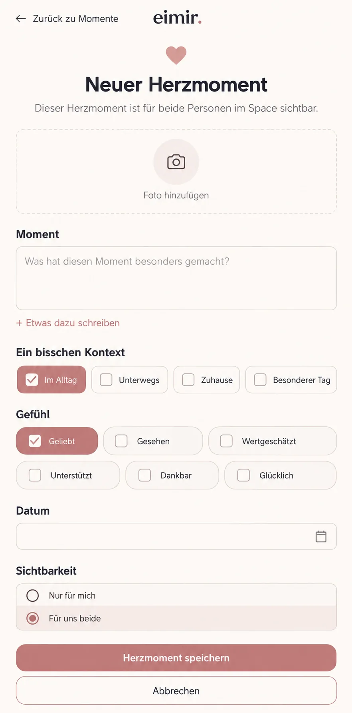

# #509 — Heart Moment context tags and optional text preflight

**Baseline:** `main@8679112295e7225cd0c659638257e45723d7e8eb` (2026-09-29), after the Memory slice in #1281 and #1282. **Scope:** Web/Mobile Web Heart Moment create, edit, detail and their protected API contract. This is a design/domain preflight, not runtime acceptance.

The generated image guides placement and hierarchy; it is not a pixel lock. Its emotion controls are illustrated as checkbox-like marks, but the **existing six-value single-select radio picker** is authoritative. Its empty date is illustrative; the real editor defaults to today. Existing localized copy, eimir. identity, tokens, photo picker and route behavior remain authoritative. Actual browser evidence is required with the runtime PR.

## Existing destination and task

`HeartMomentProductPage` at the Heart Moment create route has a back link to Momente, centered eimir. identity, heart and heading, live shared/private summary, one optional attachment picker, required thought textarea, six-emotion picker (default `LOVED`), native date (today), explicit shared/private choice (default shared), Save and Cancel. The edit route retains text, emotion, date, photo and versioned write; detail reads content, emotion, photo, comments and visibility. Quick Create leads to the same route. No separate composer, inference or taxonomy manager is introduced. Product Reference v1 R1/F2, Create/Edit and Detail View govern, with authored content dominant and Save the sole primary action.

## Mobile Interaction Contract

| Concern | Decision |
| --- | --- |
| Human outcome | Capture a small meaningful Heart Moment by selecting a feeling and a little context, optionally adding a photo or words. |
| Dominant action | Existing Save. Context choices are reversible secondary input; the six existing feelings remain one required choice, not tags. |
| Immediate content | Keep existing photo, thought, feeling, date, audience and Save in that order. Place four optional context chips after the thought and before the feeling. Keep the thought visible and optional; do not focus it or summon the keyboard. |
| Domain distinction | Curated context IDs `everyday`, `out_together`, `home`, `special_day` describe setting, not inferred feeling. They are distinct from the six `HeartEmotion` values and from Memory tags despite some shared labels. The user explicitly chooses them; no classification from a photo, text, location or partner. |
| Content validity | Text can be empty when at least one context tag or a photo is present. Emotion alone, date alone and audience alone do not produce a contentful Heart Moment. Existing text-only entries stay valid. Never persist fabricated prose merely to satisfy an old required field. |
| Read and edit | A textless result shows its selected context and feeling as authored metadata, with a localized, non-quoted heading that does not pretend the user wrote it. Edit can add/remove words, photo and tags, but cannot save an empty result. Story, Search, notifications and other read projections must not manufacture or leak a private summary. |
| Loading/empty/error | Local catalog needs no loading state. Invalid empty capture receives a clear inline explanation; pending uploads block Save; failures retain selections and the exact request snapshot. |
| Offline/return | Existing F2 create identity, draft/unknown-outcome recovery and confirmed canonical detail/return behavior apply. Offline writes remain unavailable. Cancel/Back and interrupted photo picker retain or discard work under the existing task contract. |
| Privacy | Tags are protected payload content under the Heart Moment's `SHARED` or `PRIVATE` visibility, not plaintext columns, telemetry, public events, cursors or unscoped caches. A private item must remain absent for the partner in all direct and indirect reads. |
| Compact/accessibility | Native multi-select checkbox semantics for chips, selected check plus text, targets at least 44 CSS px, wrapping at 320–430 CSS px and 200% text. The feeling remains a labeled radio group; audience remains a separate radio group. Save and errors remain reachable after the extra row. |
| Motion/Expanded | Reuse existing input feedback; reduced motion keeps selection state immediately legible. Expanded keeps a bounded reading column and the same order, not a management panel. |

## API, compatibility and reuse decisions

Use a closed, versioned catalog of four language-neutral IDs with localized labels. Store `tags: []` beside `text` and `emotion` in `HeartMomentPayload` with legacy default `[]`; keep text as a string and permit `""` only when an attachment or a tag is present. Validate unknown, repeated, excessive and null patch values at API/service boundaries. Include tags in tagged create fingerprints and exact client reconciliation snapshots; preserve the old fingerprint for untagged requests. On an unrelated edit, preserve stored tags. `If-Match` remains mandatory. Export/import, encryption, deletion, privacy revocation and old-client behavior must round-trip both tagged and textless entries. Old clients that omit tags keep their existing text-required creation behavior; a client that cannot display a textless entry must fail safely or receive an explicit compatibility treatment before release.

Reuse the Heart Moment protected payload/API, F2 create identity, generated TypeScript client, attachment picker, emotion picker, checkbox semantics, localization and semantic tokens. A tags table, external classifier, provider, new library or entitlement is unwarranted. This is Free/Core creation quality on Cloud and Self-Hosted; bounded protected storage is the only additional operating cost, with no quota, Premium or configuration change.

## Acceptance for the runtime slice

- Create from the established entry point with a tag and no text, and with a photo and no text; reject emotion-only empty capture. Select, clear and edit tags; save, open canonical detail and return to the origin.
- Preserve existing prose entries and same-key untagged replay. A different tag set with the same key conflicts; an unknown create outcome retries the exact tags and identity. A concurrent `If-Match` update does not lose tags.
- Verify private partner denial for direct/detail, list, Story/Search, cache, export and indirect projections; transfer/import and legacy payloads retain values.
- Capture exact-build Compact 360/390/430 and 320 at 200% text, Expanded, Light/Dark, keyboard/screen-reader, reduced-motion, error/offline/upload/return evidence. Inspect the whole task, not merely the chips.

This preflight resolves the cross-cutting API/privacy and composition boundary before UI implementation. The runtime PR must prove its own behavior and visuals. Native Android device acceptance is outside this Web slice.
