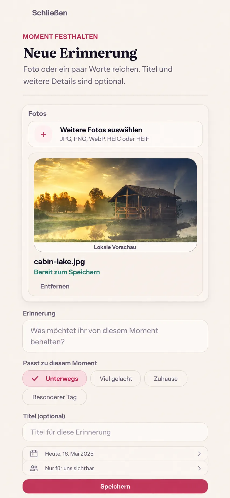

# #509 — Memory Smart Tags product preflight

**Baseline:** `main` at `e45eebb81163e1365eb5907026a0687e6619c7e5` (2026-09-29).
**Scope of this reference:** the existing Web/Mobile Web Memory capture task, one bounded slice of #509. Heart Moments and other content types need their own domain and composition review.

The generated image guides the whole-screen composition. It is illustrative, not a pixel lock or runtime evidence. Its sample photo, date, and sharing summary do not change the existing upload, date, and fixed shared-audience contracts. The actual eimir. logo, icons, tokens, localized copy, and live browser rendering remain authoritative.

## Existing destination and hierarchy

The current `MemoryCreatePage` has Close and the Memory heading; a photo picker with local preview, upload status, and remove action; an optional narrative; an optional title; a date summary with a native date editor; the fixed shared-audience note; one Save action; and F2 discard, pending, offline, partial-photo, and unknown-create-outcome recovery. Quick Create and other entry points lead to this same task. Nothing in this slice introduces another composer or bypasses the existing idempotent Memory-create attempt.

Product Reference v1 R1 and the Create/Edit capture task template govern. The selected image or narrative remains the focal content. Optional context sits below the narrative and above the title, visually secondary to content and Save. On a narrow or text-scaled screen, chips wrap and the remainder of the existing task scrolls naturally; Expanded keeps the bounded reading column.

## Mobile Interaction Contract

| Concern | Decision |
| --- | --- |
| Human outcome | Add a little context to a photo or short Memory with taps instead of typing an explanation. This should help recall without asking the couple to classify their relationship. |
| Dominant action | Existing Save. Chip toggles are secondary, reversible input in the same task. |
| Immediate/progressive content | Show a small curated set of context chips after the optional narrative. No separate modal, category browser, taxonomy editor, or automatically opened keyboard. More detail remains possible in the narrative/title. |
| Interaction | Native multi-select checkbox semantics rendered as touch-friendly chips; selection uses text/check state as well as color. No gesture-only input. |
| Loading/empty | The local catalog is available with the form, so it needs no request or skeleton. A Memory can still be captured without tags. Tags alone do not create an otherwise empty Memory. |
| Error/offline/success | Existing submit and upload states own recovery. A failed or uncertain create keeps the exact selected-tag snapshot and request identity. Offline write remains unavailable. The confirmed Memory result shows saved context without a separate success claim. |
| Privacy | Tags are protected Memory content with the same `SPACE_SHARED` read/write/retention rules as title and body. No tags in public events, telemetry, logs, cursors, or unscoped caches. |
| Narrow/large text | Chips wrap without horizontal scrolling or clipping at 320–430 CSS px and 200% text; targets are at least 44 CSS px. Labels remain localizable. |
| Motion | A small pressed/selected transition may reuse semantic fast motion; reduced motion preserves the visible check state immediately. No Save animation claims persistence early. |
| Expanded | Same content order and bounded task width. Extra width improves wrapping; it does not expose a separate management panel. |
| Return | Close/discard, picker interruption, successful canonical detail, and scoped return remain under the current F2 task lifecycle. |

## Domain and reuse decision before runtime

Use a closed, versioned catalog of stable language-neutral IDs and localized labels. The first Memory set should be small and broadly useful (for example being out together, laughter, home, and a special day), with no emotional inference from a photo or typed content. Never derive tags automatically from media, location, Vibe, Energy, or the partner. The author explicitly selects them. Persist the selected IDs inside the existing Memory protected-payload boundary, and include them in the create request's idempotency fingerprint and exact client replay snapshot. Existing payloads must read as an empty set. Edits and export/import must preserve tags; they may not disappear on an unrelated title/body edit or transfer. Server validation rejects unknown and excessive IDs. Other client versions that omit tags continue to create an untagged Memory.

The current photo picker, Memory API, generated client, F2 editor lifecycle, and semantic tokens are reused. No taxonomy service, third-party tag library, ML classifier, provider, extra queue, or new storage table is warranted for this bounded catalog. This is Free/Core creation quality in both Self-Hosted and Cloud; it changes no entitlement or quota. Storage overhead is bounded by the catalog and chosen maximum. Backend, OpenAPI, generated client, transfer, and Web edits must land together; a UI-only chip state would falsely promise saved context.

## Acceptance for the runtime PR

- Open from Quick Create, select a photo, choose and clear chips, optionally type, save, observe the same tags on the canonical Memory, and return to the origin.
- Create without tags; reject a tag-only empty Memory; edit and transfer a tagged Memory without losing context.
- Verify unknown tag IDs, duplicates/excessive IDs, concurrent `If-Match` edits, idempotent same-key replay and different-tag conflict, unknown create outcome, failed upload, offline, and account/Space switching.
- Capture exact-build Compact 360/390/430, 320 at 200% text, Expanded, Light/Dark, keyboard/screen-reader, reduced-motion and failure/return evidence. Compare the actual whole task with R1 and the image above.

This preflight establishes the required visual reference and interaction boundary. It does not assert that the feature is implemented or accepted.
