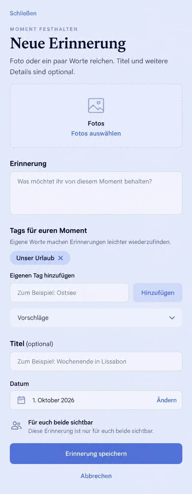

# Authored custom moment tags (#1290)

Recorded before runtime/UI implementation from main
`3f26836ad076ad1470003070f36d20494d1c5c9d`. Product Owner feedback explicitly
supersedes #509's closed-catalog decision: the four fixed categories are
insufficient; people must be able to create their own tags.

## Current surface and composition

Inspected current MemoryCreatePage, MemoryProductPage edit/detail,
HeartMomentProductPage create/edit/detail, both tag components, protected
payload/write contracts, existing #509 preflights and actual Compact capture
evidence. Memory capture already has photos, optional narrative, four context
checkboxes, optional title, date, fixed shared audience and Save/Cancel under
the F2 lifecycle. Heart capture adds its existing single-choice emotion and
private/shared audience. Preserve all of these and their current ordering.

Use Product Reference v1 R1/F2 and the Create/Edit task template. Replace the
catalog-only row with authored selected chips and an inline new-tag field.
Keep legacy choices in an optional native disclosure, closed initially.
The generated image guides hierarchy; its oversized photo area, sample date,
copy and controls do not override current picker, tokens or live semantics.
HeartMoment adapts the same editor without changing emotion or visibility.

## Reuse, domain and business decision

Store custom labels in the existing encrypted/protected parent `tags` array.
Keep existing catalog IDs byte-for-byte readable with localized legacy labels;
custom labels render as escaped text. No new tag table, global vocabulary,
autocomplete scan, AI inference, external provider or local durable draft.
A global shared catalog could disclose private HeartMoment vocabulary and is
unnecessary for adding a label to a moment. Reuse the existing create identity,
exact replay snapshot, optimistic version checks, editor lifecycle, generated
client and semantic controls. Use one small common authored tag editor and one
common validation contract for both domains instead of duplicating them.

Free/Core in Cloud and Selfhost, consistent with Memory/HeartMoment CRUD.
No entitlement, paywall, commercial quota, configuration or migration. Bound
labels to eight per record and forty Unicode codepoints, normalize whitespace
and NFC, reject blank/duplicate/oversized input at API and protected storage
boundaries. These are input validation bounds, not relationship-history quotas.
Old payloads still default to an empty list; omitted update tags preserve
stored values. Transfer, encrypted read, same-key replay and fingerprint
conflicts must retain arbitrary valid authored labels.

## Mobile Interaction Contract

- New tag field is visible and opt-in; keyboard stays closed until selected.
  Add or Enter commits the label and clears the field; Enter never submits the
  entire moment. Selected tags have localized remove actions. Suggestions use
  native checkbox semantics under `Vorschläge`; they are optional and never
  selected or inferred automatically.
- Tags remain secondary to authored photos/text and the existing Save action.
  Valid pending labels commit when leaving the field for Save; typing a draft
  must participate in existing dirty/discard behavior. Invalid labels remain
  visible with a field error and cannot be silently discarded by submission.
- Empty/duplicate/too-long/too-many input has localized feedback. Add/remove
  operates locally; network/loading/offline/conflict/uncertain-create feedback
  remains owned by the existing parent task. An unknown outcome replays the
  exact submitted tags instead of rebuilding from edited state.
- All actions have at least 44px touch targets, text wraps at 320px and 200%,
  labels and errors are associated with their fields, and removing/adding does
  not steal focus. Theme and reduced-motion use existing semantic tokens.
- Current Memory shared audience and HeartMoment private/shared permissions
  remain authoritative for tags. No labels in public events/logs/telemetry,
  cursor URLs or unscoped persistent caches. Account/Space task reset disposes
  the in-memory editor state.

## Acceptance

Custom tags survive create, edit, canonical detail, reload and protected
transfer; legacy keys stay readable/removable. Verify Enter, direct Save after
typing, duplicate/blank/length/count handling, removal, dirty Back/discard,
same-key replay/conflict, unrelated edits, private partner denial and both
themes at Compact/Expanded/320px/200% text. Web evidence only; no Android
device or new search/filter feature is claimed.
