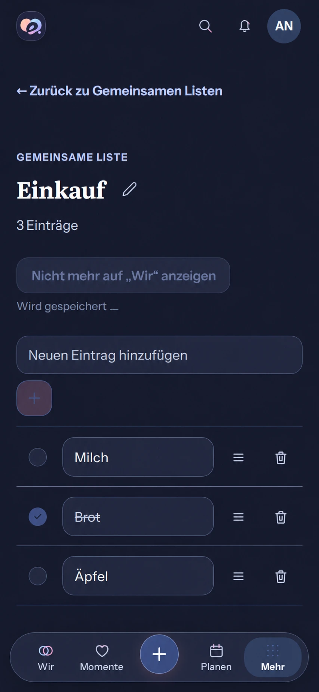

# Immediate personal list pinning — #508

## Baseline and generated reference

Baseline: `main@8dbe6e6bdbeeb0b98e5e875d4b1423b2e51ef53b`, 2026-10-05.
Reviewed the actual 390px Dark shared collection detail route: header, Back,
shared-list title/Edit/count, personal Wir action, inline Add, completion,
title inputs, reorder/delete controls and Compact navigation. The personal
pin action currently waits for the PATCH and preference refetch to change its
label. Retry currently replays the previous selection.

Generated before runtime implementation with the built-in Imagegen tool from
the actual whole-screen capture. The prompt preserves the existing shell,
content, controls and German text; only the personal action becomes selected,
disabled and accompanied by localized saving text in normal flow. Its altered
resolution and illustrative geometry are composition guidance, not a pixel
specification or functioning UI evidence. Real components, assets, containers,
semantic tokens and accessibility remain authoritative.

Mandatory engineering/product sources reviewed previously remain unchanged
on this main. Rechecked private/shared classification, dashboard preference
API and atomic facet updates, checklist/detail templates, saving/retry,
Mobile Interaction Contract and generated-reference gates for this scope.

## Mobile Interaction Contract

| Concern | Contract |
| --- | --- |
| Human outcome | Personally show/remove this shared list on Wir with immediate, honest feedback. No extra typing or keyboard activation. |
| Authority/pattern | Product Reference v1 R5 utility, Detail View and native labeled button; readable checklist is appropriate for list content, not an administrative table. |
| Composition | Existing title and list remain focal. Preserve Back, Edit, count, Add, completion, rename, reorder/delete and navigation. The secondary personal button changes immediately and a small polite saving status follows it. No celebration or new relationship copy is appropriate to a presentation preference. |
| Pending/result | Capture initiating Account, Space and selected ID; patch only selection and, when pinning, visibility. Keep the submitted selection visible across background reads. Prevent duplicate writes synchronously, without inventing a server version. Confirm using the returned preference, then refresh the current authoritative list. |
| Recovery | Roll back only the optimistic preference still owned by this request; never overwrite a replacement read or unrelated modules/order. Show a persistent existing error. Retry reads current preferences rather than replaying a stale write; another explicit toggle uses the recovered state. |
| Privacy/scope | This is personal Account/Space presentation of an already authorized shared list. Late results touch only the same existing initiating query; removed/recreated queries are not revived. No private projection, log, analytics or persistent draft. |
| States | Initial/read failure blocks the pin action and gives read-only Retry. Empty lists keep their existing Add state. Pending blocks duplicate pin actions; unrelated list controls remain usable. Failed recovery preserves authorized content but blocks pinning. Denied access hides invalid preferences. No offline-write queue or sync promise. |
| Accessibility/motion | Native button exposes pressed state and references localized polite pending text. Existing press motion/tokens; no spinner or moving result. Reduced motion has the same semantics and immediate feedback. Preserve focus, target size, wrapping and return. |
| Compact/Expanded | 320/360/390/430px and 200% text wrap in normal flow. Expanded keeps the same bounded detail and personal action. Light/Dark reuse current roles. |
| Acceptance | Open list → pin held response → see selected pending → confirm → Wir shows the list → return → unpin held response → confirm. Cover fast repeated input, background reads, 500/409, unavailable recovery, read-only Retry, unrelated/newer cache data, Account/Space changes and removed caches; sparse/dense, Light/Dark, reduced motion, large text and Axe. |

## Reuse, business and cross-cutting review

**Reuse review relevant:** reviewed native button/pressed/status semantics,
installed TanStack Query mutation/query cancellation and scoped caches, the
existing optimistic collection/check-in patterns and `ProblemState`.
A separate optimistic-state/sync library or provider adds no useful capability.
Reuse these existing components and add only the bounded personal preference
transaction guard. No new dependency, provider, license, data flow, cost or
user/hoster configuration. The existing generated Dashboard API is unchanged.

**Business/freemium reviewed:** shared lists and basic interaction quality are
Free/Core; Cloud and Self-Hosted remain identical. Personal visibility is not
shared ownership or an entitlement. No quota, retention, downgrade, export,
restore, managed-resource or authoritative matrix changes.

The preference API is an atomic facet update without `If-Match`; it deliberately
has no exposed revision. Do not claim cross-device conflict prevention. Cancel
older reads, guard local rollback/reconciliation and refresh authority after
settlement. Security remains server authorization. Cache guards must prevent
late response recreation and cross-account/Space application. Existing i18n,
pressed/status semantics, focus and reflow are required. Failures stay visible;
recovery is a read, never automatic write replay. No API/schema/migration,
telemetry, media, backup, release or native-wrapper changes. Unit and canonical
Web browser evidence will cover the transaction boundaries before merge.
