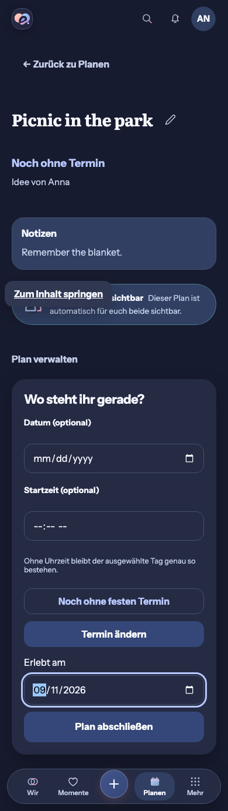
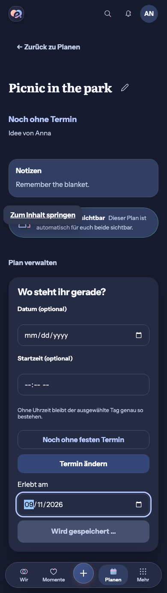
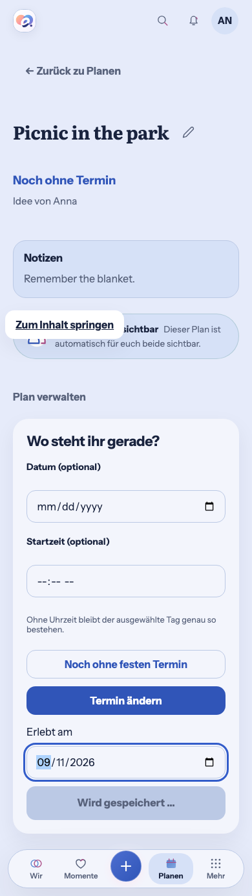

# Honest immediate Plan completion feedback — #508

Status: **preflight prepared; the generated whole-screen Compact reference is
still outstanding.** No UI implementation may start until it is attached to
#508 (`docs/PARTNER-APP-EXPERIENCE-STANDARD.md` section 9A).

## Baseline

Baseline: `main@4aa0806523a55dfafbee94d4479c6ffe06825303`, 2026-10-05
(after #1294). No open pull request touches `PlanProductPage`,
`PlanStoryContinuation` or the Plan completion API (open PRs are Dependabot
bumps, #1271 UnifiedPush and #1275 Android demo flags).

Shipped #508 slices re-verified on this baseline: shared and private checklist
toggle and reorder, own Energy, own Vibe, personal collection pinning. The
remaining items from the issue are reactions, other suitable toggles and the
Plan-to-Memory journey.

## Candidate selection (evidence)

Reviewed the actual destination (`web/src/components/PlanProductPage.tsx`,
`PlanStoryContinuation.tsx`, `planning-completion-story-continuation.spec.ts`):

- **Reactions:** no reaction feature exists in the Web client
  (`grep -i reaction` finds only attachment-draft code). Not a candidate.
- **Other mutation surfaces** (Gift ideas, Daily Quote settings, Wish forms) are
  form submissions, not immediate toggles.
- **Wish completion** shares the same irreversible semantics as Plan completion.
- **Plan completion:** the generated Plans API has `complete`, `schedule`,
  `unschedule`, `return-to-wish`, `update` and `delete`, but no reopen
  operation. A confirmed completion cannot be undone, and the server decides the
  shared-achievement header. It is therefore **not** a safe optimistic-state
  candidate: the completed status, completion celebration, Memory/Milestone
  continuation and shared achievement must stay server-confirmed.

Decision: select Plan completion, but only as **honest immediate pending
feedback plus transaction safety**. Nothing is shown as completed before the
authoritative response.

### Gaps measured on the real baseline

Measured with a held `POST /plans/{id}/complete` at 390 px (Light and Dark,
captures below):

| Observation | Result |
| --- | --- |
| Two activations in the same task | **Two** completion requests are sent (button is disabled only after re-render). |
| Pending announcement | Button text changes to "Wird gespeichert …", but there is **no** `role=status`/live region. |
| Other lifecycle actions while pending | Edit, "Termin ändern", "Noch ohne festen Termin" (and return-to-wish/delete via edit) stay enabled and can race the completion on the same `If-Match` version. |
| Feedback location | Pending text exists only inside the collapsed "Plan verwalten" disclosure, below the fold on Compact. |

Existing behavior to preserve: explicit `experiencedOn` date sent unchanged,
completion without a Memory, optional Memory/Milestone continuation, "Später",
server-confirmed `X-Eimir-Shared-Achievement` celebration exactly once, and
failure followed by a deliberate retry.

## Baseline captures (inputs for the generated reference)

Reviewed on screen: shell header with search/notifications/avatar, Back, title
with Edit, schedule/status line and creator, Notizen, shared-visibility note,
the "Plan verwalten" disclosure with schedule fields, the completion date and
CTA, and the four-destination Compact navigation. The `Zum Inhalt springen`
overlay in one capture is the focused skip link from the test run, not product
content.

## Mobile Interaction Contract

| Concern | Contract |
| --- | --- |
| Human outcome | Mark a shared plan as experienced on a chosen day and trust that exactly one completion is happening. |
| Reference and template | Product Reference v1 detail view / R3 Planen; existing detail, lifecycle disclosure, `ProblemState`, `role=status` pending pattern from the Collection row. No new navigation, gesture or typing. |
| Focal point and dominant action | The plan title and its status stay focal. The completion CTA stays the dominant action inside the existing disclosure. |
| Immediate | On submit the CTA is claimed synchronously (ref guard, no second request even within one task). A small polite localized status that names the submitted day appears in the summary area, visible without opening the disclosure. The disclosure stays open and the date keeps its value. |
| Not claimed | While pending: no "Gemeinsam erlebt" status word, no celebration, no continuation, no optimistic cache write. The plan query keeps the last confirmed server state. |
| Locked while pending | Completion date, CTA, schedule/unschedule, return-to-wish, Edit and delete cannot start a competing write on the same version. Back remains available. |
| Success | Commit the returned plan to the initiating Account/Space/plan cache, reconcile plan lists and dashboard, then show the existing continuation. The shared achievement appears only when the server header confirms it. |
| Failure and conflict | Remove the pending status, keep the entered date, show the existing inline error. On 409 refetch authoritative data before another decision; never replay the stale `If-Match`. If another member completed meanwhile, show the confirmed completed result without celebration. |
| Offline | The write fails visibly. No outbox, durable draft or later-sync promise. |
| Late responses and scope | The response belongs to the initiating Account, Space and plan. After navigation, Account or Space switch it only reconciles that scoped cache and never shows celebration, status or continuation elsewhere. Background reads never snap pending state back. |
| Privacy | Only the already-shared plan and the entered day are involved; no new telemetry, partner-state signal or storage. |
| Motion | Reuse existing status/press tokens; no spinner or moving success. Understandable with reduced motion and screen readers (`role=status`). |
| Compact/Expanded | 320/360/390/430 px and 200 % text wrap in normal flow; Expanded keeps the bounded detail. Light/Dark use semantic tokens. |
| Acceptance | Open plan → open actions → choose day → complete with held response → see single pending status → confirm → Memory/Milestone/Later → return. Also failure + retry, 409, duplicate activation, background read, Account/Space change, offline and unmounted late response. |

## Reuse review

Considered: a custom optimistic sync layer, adding a reopen API to enable an
optimistic rollback, a toast library, and the existing stack. Selected the
installed TanStack Query mutation state, the existing `useRef` in-flight pattern
(`CollectionProductPage`, `useCollectionPin`), the existing `role=status`
pending style, `ProblemState`, semantic tokens and `m5s3` localization.
No new dependency, provider, license, data flow, cost or user effort. Adding an
undo API would be a product/domain decision and is out of scope.

## Business / freemium

Business/freemium impact reviewed: `Wish & Plan lifecycle` is **Free/Core**,
identical for Cloud and Self-Hosted (`docs/FREEMIUM-FEATURE-MATRIX.md`). No
entitlement, quota, retention, downgrade, export or managed-resource change.

## Cross-cutting

Security/privacy: server authorization unchanged, no new cache that outlives
scope. i18n: new status strings in `m5s3` (German; the only locale catalog).
Accessibility: `role=status`, locked controls announced as
disabled, focus remains on the CTA until the result replaces it and the existing
continuation heading takes focus. Concurrency: single in-flight completion,
`If-Match` unchanged, conflict refetch without replay. Resilience: no offline
write replay. Observability, API/schema/migration and release impact: none.
Tests: component tests for the transaction guard, lock and scope; browser tests
for held, confirmed, failed, conflict, offline and scope changes.

## Remaining prerequisite

The generated whole-screen Compact reference must be produced from the baseline
captures above (shell, content and existing functions preserved; only the single
pending status and locked controls added) and linked in #508. The authoring
session had no image-generation capability.
