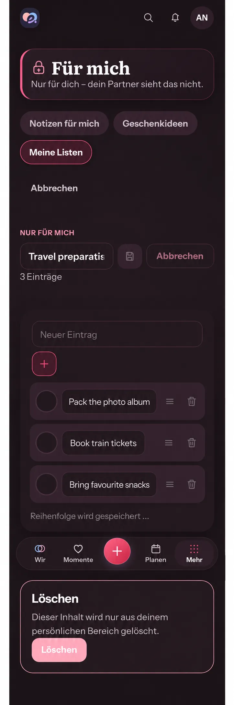

# Immediate private list reorder — #508

## Baseline and destination

Baseline: `main@a6543f91b28806a508ce297dc97d91f0c7ad69d1`, 2026-10-02.
Reviewed the actual 390px Dark private collection Edit route after #1292:
the shell, privacy banner/tabs, Cancel, title editor/count, inline add,
completion controls, title inputs, reorder/delete buttons, collection deletion
and Compact navigation. Reorder currently clears its gesture preview before
the server confirms, causing the list to return to the old order while saving.

Previously read mandatory engineering/product sources are unchanged between
the previous baseline and this main; the private domain/version contract,
checklist row and detail/edit templates were rechecked for this slice.

## Generated Compact reference

Created before UI code using the built-in Imagegen tool and the actual Edit
screen. Format conversion to WebP preserves its dimensions. The whole-screen
prompt preserves the shell, owner-only copy, tabs, title/count, add, native
unchecked controls, title inputs, handles/delete, primary navigation and delete
section; only the order changes to album/tickets/snacks with quiet localized
pending text and disabled overlapping actions. This is composition guidance,
not functioning UI evidence. Actual assets, geometry, containers, tokens and
German i18n remain authoritative; illustrative input widths are not a redesign.

## Mobile Interaction Contract

| Concern | Contract |
| --- | --- |
| Human outcome | A moved private item remains where it was placed after release, with honest pending feedback and safe recovery. |
| Authority/pattern | Product Reference v1 checklist and private-content rules; SCREEN-TEMPLATES section 11 Detail View with section 9 Create/Edit disclosure; COMPONENT-CONTRACTS section 6.4 Checklist Row. |
| Hierarchy/action | Personal titles remain focal. The existing handle supports pointer drag and keyboard arrows in Edit. No new navigation, input, gesture, romantic copy or celebration. |
| Immediate/confirmed | Present the submitted order at release; keep it across background reads while the request waits. Keep server versions unchanged, prevent duplicate/overlapping writes, and reconcile the returned collection before another operation. |
| Failure/conflict | Roll back only positions at the initiating root version, preserving unrelated content and newer authoritative snapshots. Show the existing inline error. Refresh the authorized detail on settlement; a retry refreshes rather than replaying the stale order. |
| Privacy/context | Capture Account, Space, collection and version. Late responses must only update an existing initiating cache and must not overwrite a newer collection or recreate removed private data. No new shared projection, log, event or durable store. |
| States | Initial load/empty and read-first presentation stay intact. Ordinary/offline failures restore confirmed order. Failed recovery keeps authorized content readable and blocks writes; denied/not-found access hides it. Success removes pending status and uses the returned version. |
| Motion/accessibility | Reuse the current pointer/keyboard hook and semantic motion tokens. Gentle reorder preview respects reduced motion; saving status is textual and polite. Preserve 44px targets, native keyboard actions and return/draft protection. |
| Compact/Expanded | Same grouped checklist/Edit controls at 320/360/390/430px and 200% text; Expanded keeps the bounded existing detail. Pending text wraps in normal flow. |
| Acceptance | Open → Edit → drag/release or keyboard move → observe held response → confirm/fail → observe authoritative order/version or rollback → retry/cancel/return. Cover rapid input, background refresh, unrelated/newer data, 409, offline recovery, scope switch/cache removal, Light/Dark, sparse/dense, large text, reduced motion and Axe. |

## Reuse, business and quality

**Reuse review relevant:** considered waiting for confirmation, the installed
TanStack Query lifecycle/shared collection optimistic order pattern, and a
separate sync/drag library. Reuse Query, `useListItemReorder`, native controls,
`ProblemState`, existing localized saving copy and semantic tokens. A small
private-domain position patch with temporary presentation is needed for scoped
versions and privacy. No dependency/provider, license, external data flow,
cost or hoster setup is introduced.

**Business/freemium impact reviewed:** private lists and basic interaction
quality are Free/Core in the authoritative feature matrix. Identical Cloud
and Self-Hosted behavior; no entitlement, ownership, quota, retention,
downgrade, export/restore, managed-resource or matrix change.

Cross-cutting review retains server `If-Match`, versions and owner-only
authorization. Rollback changes order only; background and late-response
handling must preserve unrelated state. Recovery is a read, never an automatic
write replay or offline sync promise. Existing i18n, pressed controls, keyboard
handle and pending/error status stay accessible. No API/schema, migration,
release/backup configuration, telemetry or persistence changes. Evidence is
the canonical Web app; no native wrapper capability changes.
