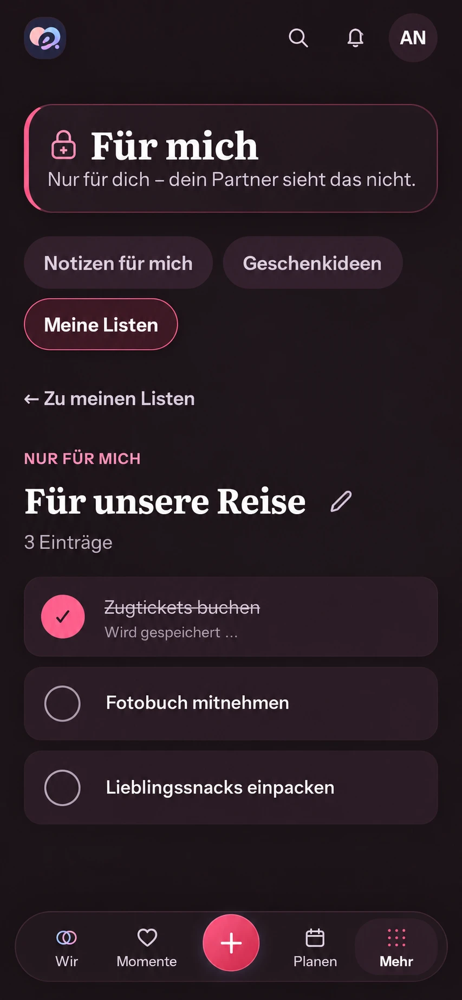

# Immediate private checklist feedback — #508

## Baseline and scope

Baseline: `main@882043aed83090e517583e62faa5cf2d5efd4485`, 2026-10-02.
Reviewed `PrivateAreaProductPage`, the real Compact private collection detail,
`CollectionItems`, scoped private query keys, and the accepted shared checklist
feedback in `CollectionProductPage`. Existing shell, privacy banner, private
tabs, Back, title/count, edit action, read/check-first items, and primary
navigation remain. Add/remove/rename/reorder stay behind the existing Edit mode.

Rechecked after #1291 at `main@06bd4e9300f7febebcecc42164a28ea0a67ef55a`:
the private destination, shell and checklist are unchanged, so the generated
composition and interaction contract still apply.

This fifth #508 slice changes only private item completion feedback. It does
not claim to complete #508 or add immediate private reorder, offline writes,
shared discovery, a notification, or another persistence layer.

## Generated whole-screen Compact reference

Generated with the built-in Imagegen tool from the actual current 390px dark
private detail screenshot, before UI code. The prompt preserves the full shell
and shows three checklist items with only the first checked and its quiet
pending status. This is composition guidance, not functioning UI evidence or a
pixel lock. Actual assets, tokens, grouped-list container, and existing controls
remain authoritative. The image's illustrative row spacing and pencil
placement do not authorize a redesign.

## Mobile Interaction Contract

| Concern | Contract |
| --- | --- |
| Human outcome | Check or reopen a personal list item immediately, with an honest pending state and reliable failure recovery. |
| Authority and pattern | Product Reference v1 content-type checklist/private-content rules; existing grouped checklist detail and explicit management mode. Reuse the current native pressed button, private accent, `ProblemState`, Query client and semantic styling. |
| Focal point and hierarchy | Personal item titles remain first. The existing checkbox is the row action; Edit remains secondary. No new gesture, navigation step, typing, modal or celebratory toast. |
| Immediate / confirmed | Show the submitted completion value and localized saving copy on that row while waiting. Keep its server version unchanged, prevent overlapping item operations, then reconcile with the actual returned item and authorized detail. |
| Failure / conflict | Restore only the affected completion value, preserve unrelated data, and show the existing inline error. Refresh the authoritative detail before another decision after a conflict; never replay stale `If-Match`. A manual refresh is available if recovery fails. |
| Privacy / context | Only the initiating Account/Space/private collection key may change. A late callback must not recreate a removed cache or affect another context. No private titles, counts or state enter shared projections, logs or durable storage. |
| Loading / empty / offline / success | Existing initial loading and empty presentation remain. Retain the authorized list during recovery; failed/offline writes roll back and never imply queued saving. After confirmation remove pending copy and use the returned version. |
| Motion / accessibility | Existing private checkbox/completed styling supplies restrained feedback. Text and pressed state work with reduced motion. Preserve touch targets, keyboard focus and wrapping; associate row pending status with its control. |
| Compact / Expanded | Same read/check-first composition at 320/360/390/430px and 200% text. Saving copy wraps beneath its own title. Expanded keeps the bounded existing detail instead of introducing a management table. |
| Acceptance | Open → toggle → observe before response → confirm/fail/conflict → observe returned version or rollback → retry/return. Cover rapid duplicate, background refresh, unrelated updates, Edit operations, context switch, sparse/dense, Light/Dark, large text, reduced motion and Axe. |

## Reuse, business and cross-cutting review

**Reuse review relevant:** reuse the installed TanStack Query lifecycle and the
shared collection's scoped optimistic update pattern, plus existing native
button/status/error components. Alternatives are waiting for the response (the
current lag), a separate sync engine, or a third-party checklist component.
Neither a dependency nor another store is needed for this reversible update.
No new provider, license, data flow, cost or hoster setup is introduced.

**Business/freemium impact reviewed:** Free/Core private lists and fundamental
interaction quality, per `FREEMIUM-FEATURE-MATRIX.md`. Cloud and Self-Hosted are
identical. Ownership, entitlements, quotas, retention, export/restore and
downgrade semantics are unchanged; no managed infrastructure is added.

Concurrency preserves `If-Match` and server versions, cancellation of in-flight
reads, narrow rollback and authoritative recovery. Existing localization and
privacy rules govern pending/errors. No API, migration, cache persistence,
backup, release configuration or telemetry change is needed. Web browser
evidence is required; this slice makes no native-device acceptance claim.
