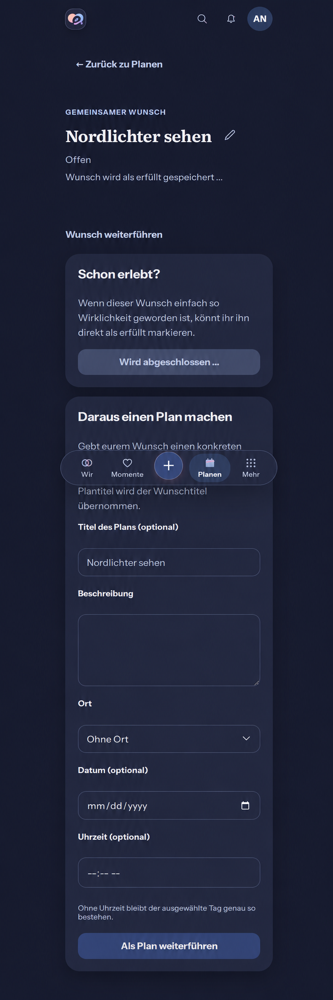

# Wish completion feedback preflight

Owning issue: #508. Baseline main: `5cf7bdd27633dcf1757a11199973f57258adc2f7` (2026-10-09).

Reviewed current WishProductPage, completion and conversion APIs, the shell and navigation,
Plan completion primitive, semantic tokens, Product Reference v1 interaction/feedback rules,
R3 Planning, Detail View and Create/Edit templates. Open PRs #1296, #1275 and #1271
have no overlapping Wish implementation. Plan completion #1297 and audit maintenance #1298
are merged. Wish completion has no reopen operation; it must stay server-confirmed.

## Measured baseline

Two native button activations in one browser task produce two completion requests.
Edit and conversion remain available during the held response. Saving copy is confined
to the management disclosure. The [actual baseline](wish-completion-baseline-390-dark.png)
shows every currently reachable conversion field and completion action.

## Generated composition reference

Generated with built-in Codex Imagegen before UI implementation. This is a composition
reference, not a pixel lock or runtime evidence. It retains the title, last-confirmed open
status, Back, edit entry, full completion/conversion sections, shell and navigation, adding
only a summary status and unavailable competing writes. The image approximates icons,
geometry and disabled appearance; actual assets, localized copy and token contrast prevail.
The fixed navigation crossing the full-page capture is a capture artifact, not new placement.
[Generation record](wish-completion-generation.md).

## Mobile Interaction Contract

| Concern | Contract |
| --- | --- |
| Outcome and relationship value | Mark an already experienced shared wish fulfilled with immediate honest feedback; preserve trust and the optional Memory continuation. |
| Reference and focal point | Product Reference v1 feedback/result ownership, R3 Planning and existing Detail View. Wish title remains primary; operational fields stay disclosed. No new table/list pattern. |
| Primary action | Existing direct-completion button. No added typing, keyboard activation, gesture or destination. |
| Compact and Expanded | Same bounded detail and existing disclosure. One plain polite status after the title summary, outside the disclosure; no new card/toast/spinner. Expanded preserves hierarchy. |
| Initial, empty and unavailable | Existing loading, absent route, permission and not-found states retained. No fabricated wish data. |
| Pending | Claim once synchronously in mutation cache; survives remount. Preserve last-confirmed state; keep focus on the completion action with aria-disabled. Lock edit, delete and conversion, including same-task competing submissions. Keep conversion draft intact. |
| Error and offline | Remove saving claim, retain content/draft, show existing ProblemState. No offline queue or automatic write replay. Another explicit attempt is allowed after recovery. |
| Conflict | Refetch authoritative detail on 409/404/403 before releasing the write lock; do not replay stale If-Match. An independently fulfilled wish shows plain completed content, without our continuation. |
| Success and return | Authoritative completed response/version first; then transient optional Memory continuation with existing heading focus. Done restores Back focus; reload does not recreate the continuation. Back uses current validated task origin. |
| Scope and privacy | Mutation keyed by Space/resource; initiating query identity protects cleared/replaced caches and cross-account/Space changes. Late completion cannot open a continuation in another scope or recreate a cleared cache. No new persistence, telemetry or content in URLs. |
| Motion and accessibility | Reuse existing success motion and semantic pending/button tokens; no looping pending animation. Reduced motion retains status/result/focus. Check keyboard, Axe, 320 px/200 percent text and 360/390/430 px. |
| Acceptance | Open, double-activate under held response, confirm/fail/conflict, deliberately retry or finish, observe result, return. Cover remount, scope/cache changes, both competing-write orders, retained conversion inputs, Light/Dark, Expanded and reduced motion. |

## Reuse and cross-cutting review

Reuse installed TanStack Query mutation state/cache, existing Plan completion ownership and
normalization, ProblemState, existing aria-disabled action styling and success motion.
Extract a small shared completion lifecycle used by both Plan and Wish adapters; domain
request/result/achievement semantics stay in the adapters. Alternatives: duplicate hook,
custom synchronization layer, toast library or optimistic completion requiring a new reopen
API. The existing framework and a shared lifecycle avoid duplicate ownership contracts and
add no dependency or provider. No API/schema/migration/native wrapper changes.

Business/freemium impact reviewed: Wish & Plan lifecycle is Free/Core, identical on Cloud
and Self-Hosted. No entitlement, cost, quota, retention, downgrade or export change; matrix
unchanged. Security retains capabilities and If-Match. Performance adds no polling or
background service. Recovery reads occur only on affected conflict/permission/not-found.
No new observability or infrastructure. Cross-cutting validation focuses on concurrency,
privacy, i18n, accessibility, resilience and compatibility with existing Plan acceptance.

