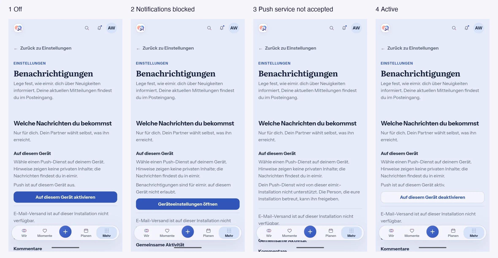

# UnifiedPush device control: Product Design Preflight (#565, PR #1271)

Recorded on 2026-10-06 before continuing UI work on PR #1271. The PR already had a first device
control implemented without this preflight, so the preflight is retroactive for that part. It
governs every further UI change in the slice. Baseline: `main` at
`4aa08065feb5bd1d18b4b3b0ea8f88ea2b6e8f8b`, merged into the PR branch at `f215444f`.

## How the reference was generated

The reference is not a free-form mockup. It was rendered on a Pixel 10 Pro Fold (outer display)
from the real `/more/settings/notifications` route of the baseline plus PR build, signed in as a
local QA account. Only the status line and action row of the device block were replaced with the
proposed state copy. Header, back link, category heading, the existing notification intro, the
per-event channel preferences that follow, and the bottom navigation are the shipped screen. The
status bar was cropped out.

Existing screen and functions reviewed and kept in place: Settings category page (template 8),
back navigation, notification intro, the `notificationSettings` channel and per-kind preferences,
email availability notice, Quiet Hours and anniversary reminders below, four-destination bottom
navigation with the central create action.

## Product Reference and template

- Product Reference v1 D6 (Profile/Settings stay discoverable) and the R5 calm utility grouping.
- `docs/SCREEN-TEMPLATES.md` section 8 (Settings and Privacy, required state: permission denied or
  blocked) and section 12 (No Permission: link to system settings when permanently blocked, no
  repeated automatic reopening of the prompt; retry only when technically meaningful).
- Components reused: existing `button-link` and `secondary-link` buttons, `form-actions`, settings
  functional panel typography and spacing tokens. No new component or token.

## Mobile Interaction Contract

1. **User goal:** receive a calm signal on this phone when something new arrives, without anything
   private appearing outside eimir.
2. **Relationship value:** partner gestures such as thinking-of-you reach the partner in time. The
   signal stays neutral on the lock screen.
3. **Primary Compact state:** the device block inside Settings > Notifications, directly under the
   section intro and above the per-event choices.
4. **Single dominant action per state:** off = enable on this device; blocked permission = open the
   system notification settings; active = disable on this device (secondary style); not accepted or
   unavailable = no enable action, only the explanation. Disable is offered only while this device is
   actually registered with a distributor, never for a state that was never enabled.
5. **Hierarchy:** block heading, one-sentence privacy promise, live status line, at most one
   primary and one secondary action. The event preferences keep their order below.
6. **Immediate vs. progressive:** status and the single action are immediate. Distributor choice
   and the Android permission prompt appear only after the user taps enable.
7. **Pattern:** inline settings block plus the platform permission dialog and the UnifiedPush
   distributor selection. The system app-notification settings screen is opened for a blocked
   permission.
8. **Loading:** `deviceLoading` status, no action.
9. **Empty:** not applicable. Off is the neutral initial state.
10. **Error:** `deviceError` with enable as retry only for transient failures (backend unreachable
    while registering). `deviceUnsupported` (backend rejected the distributor origin) has no retry.
    `deviceNoDistributor` explains that a push service app is needed.
11. **Offline:** if the status cannot be checked because the backend is unreachable,
    `deviceStatusUnavailable` explains this, and enable retries the check. It is not presented as
    "not available on this installation", which is reserved for an unconfigured transport.
12. **Success:** `deviceOn`, announced through the polite live region.
13. **Privacy:** the Android notification contains only the app name and the generic
    `push_notification_body` string, visibility private, and one collapsing notification. Signing out,
    switching account, or disabling removes it. No names, kinds, IDs, or content appear in payload,
    notification, or logs.
14. **Large text / narrow:** status and buttons wrap. Buttons span the content width at 320 px and
    200% text, as in the existing evidence.
15. **Motion:** none added. Status changes are text updates through the live region, so reduced
    motion is unaffected.
16. **Expanded:** the same block inside the bounded settings column. The device control only exists in
    the native wrapper, and Web keeps its current panel.
17. **Table/list:** none.
18. **Platform patterns:** Android runtime permission prompt, the UnifiedPush distributor selection, and
    the system app-notification settings intent. No custom permission UI.
19. **Typing:** none. Every step is a tap.
20. **Generated reference:** above, baseline SHA recorded, existing functions listed.
21. **Visual acceptance plan:** Pixel Compact captures for off, blocked, not accepted, active and the
    system notification. Expanded is checked on the unfolded display. Component renderings cover Light/Dark
    and 320 px / 200% text, since system theme and font scale are not changed on a personal device.
