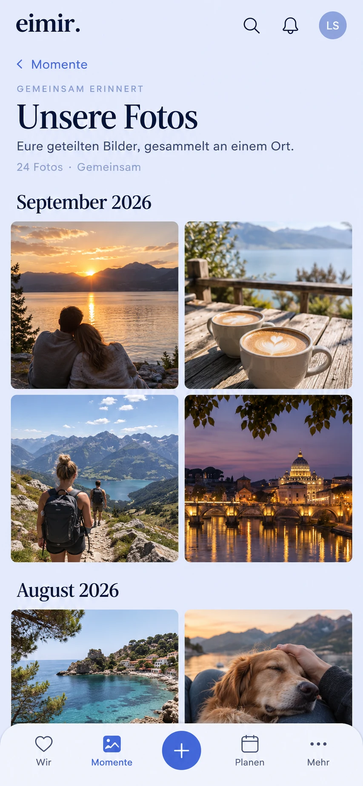

# Shared photos: Web slice of #601

Status: implementation preflight, recorded before UI code.
Baseline: `main` at `3f26836ad076ad1470003070f36d20494d1c5c9d`.

## Current destination and generated reference

The baseline Momente source, route composition, browse layer, media viewer,
tokens and owner identity assets were inspected. The existing destination has
Entdecken and Zeitleiste, a structural browse row (milestones, chapters, years),
the global header and the four primary destinations with quick capture.
All remain; add Photos to the browse row and a secondary `/story/photos` page.
The historical #972 screenshot was inspected for shell composition, while the
current blue palette and owner assets are authoritative. A local baseline
browser attempt was blocked by the unavailable Playwright browser download.

The image establishes a photo-led, month-grouped two-column Compact gallery,
quiet shared context, back link and retained shell. It is a composition guide;
implementation uses the existing owner logo, typography, tokens and navigation,
not the generated wordmark. Expanded adds columns inside the reading width.
The regular grid is appropriate for browsing photographs, not a replacement
for the asymmetric Entdecken experience. No new upload flow or primary tab.

## Reuse and business review

- Reuse existing Attachment, MemoryAttachment and HeartMoment bindings,
  `readable()`, effective Story dates and signed keyset cursors. A dedicated
  read projection is necessary because the timeline includes owner-private
  items and paginates moments rather than photographs. No Photo entity.
- Reuse MediaGallery's viewer, modal focus/scroll lifecycle, Object URL resource
  ownership, MemoryPreview's viewport loading and authorized variant reads.
  Extend MediaGallery with an optional custom preview surface and bounded
  original loading; preserve its existing carousel callers. Reuse the existing
  overlay history entry for read-only Back dismissal rather than adding a
  second history mechanism.
- A separate viewer/grid framework and a second photo store were rejected:
  they duplicate established media and authorization contracts.
- Free/Core: this is another way to read existing shared memories and images,
  consistent with BUSINESS-MODEL and FREEMIUM-FEATURE-MATRIX. Existing Cloud
  storage quotas still apply to upload; Selfhost remains unmetered. No new
  entitlement, paywall, limit or premium callout is introduced.

## Data and mobile interaction contract

- Server selects only same-Space, READY IMAGE attachments whose current parent
  is SPACE_SHARED, including all photos of a Memory and the optional shared
  HeartMoment image. OWNER_ONLY is excluded even for the owner. Existing
  readable/binding checks authorize byte reads again. No storage keys, signed
  URLs, parent text or private counts appear in the projection.
- Newest effective day first (happenedOn or UTC creation date), deterministic
  parent ordering, attachment position preserved. Signed continuation binds
  account, Space and collection. Small bounded pages and an explicit load-more
  action; no client scan of the whole timeline or unbounded original prefetch.
- Overview reads thumbnail variants where available, only near the viewport.
  Opening a photo loads the original and immediate neighbours. Object URLs
  are consumer-owned, aborted/revoked on removal, modal close and account/Space
  changes; late responses cannot publish into a new context. No durable photo
  payload/URL cache. Known authorization failures trigger projection refresh.
- Touch photo opens the shared fullscreen viewer. Swipe, keyboard arrows and
  visible previous/next controls browse loaded photos. Escape, close and system
  Back dismiss the viewer, restoring the triggering tile and scroll position.
  “Zum Moment” opens the canonical parent detail after removing the overlay
  history entry; task return restores the gallery's loaded pages and position.
- Header and Momente bottom navigation stay visible in the overview. All
  controls have 48px targets; at 320px and 200% text there is no page overflow.
  Month headings and buttons have meaningful localized accessible names;
  light/dark and reduced-motion use existing semantic tokens and contracts.
- Loading, empty, media unavailable, page error/retry and offline states are
  explicit. Failed images do not block the remaining gallery. Initial errors
  disclose no count; later page failures keep successfully loaded photos.

## Acceptance and exclusions

Verify chronological pagination (including equal timestamps and multi-photo
parents), private-owner/partner/foreign-Space exclusions, byte revocation,
cursor tampering and account binding. Verify lazy thumbnail/original request
budgets, delayed response disposal, viewer navigation/Back/focus, source return,
Compact/Expanded light/dark, 320px, 200% text and reduced motion.

This slice does not deliver Android device evidence, uploads, locked-content
features, year recaps, sharing/public galleries, chapters or archive gestures.
#601 remains open for its other slices. #508, #515 and #1268 are unchanged.
