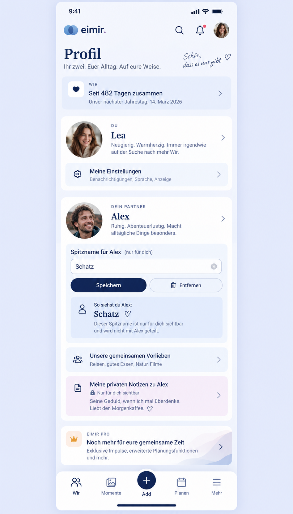

# Partner nickname visual and product preflight (#794)

Baseline: `main@9761f923aef4bcfc10191d9005d39c1d1ac1a763`, reviewed before UI implementation. The destination is `/more/profile`: `ProfilePage`, `RelationshipSummarySection`, `ProfileIdentityPanel`, `ProfilePreferencesSection`, `PartnerIdentityPanel`, `PartnerProfileSection`, and the separate private partner-note entry. The app shell retains Wir, Momente, Add, Planen, and Mehr. Today, Story/Timeline, activity, planning, and related surfaces currently render partner names from their existing Space or author projections.

The generated image guides placement, hierarchy, and the relationship context. It is not a pixel specification: it invents descriptive profile copy, a relationship tile, and a different brand mark. Implementation must retain the actual existing profile structure, eimir. identity assets, route behavior, and localization resources. No fictional profile text or new tile is to be copied from the image.

## Mobile interaction contract

- Product Reference v1 R5 and the Settings/Privacy and short Create/Edit templates own the interaction. The partner is the focal point; the nickname is a quiet viewer-owned action near their identity, not a second account-name editor.
- Compact is normative. Show current nickname or first-name fallback before editing. Open one short editor, let the viewer save or remove the nickname, return focus and context, and show the updated label immediately. Expanded keeps the same order with comfortable line length.
- Loading, empty, error, offline, and success states remain understandable without blocking profile reading. Save failure preserves the draft. Reduced motion retains the same state feedback without animation. The existing private partner-note boundary remains visually separate.
- The nickname must never imply a shared rename. Former/deleted-member presentation takes precedence over this preference.

## Reuse and cross-cutting review

- Reuse the existing Space membership guard, Profile/Identity primitives, React Query cache, short edit pattern, semantic tokens, and localization layer. A generic profile preference is unsuitable because a nickname is a typed viewer-to-partner identity preference, not a visible profile fact or a free-form preference card. No external provider or new infrastructure is needed.
- Business/freemium impact reviewed: PartnerProfile/ProfilePreferences are Free/Core in the v1.2 matrix. This personal relationship label remains Free/Core in both Self-Hosted and Cloud, with no new managed-resource cost, quota, or entitlement boundary. It must survive a downgrade and remain subject to ordinary export/deletion rights.
- Security/privacy: bind writes and projections to authenticated viewer, active Space and active named partner. Never serialize the nickname into the partner's own projection or another Space; never override former/deleted-member labels. Keep user text out of logs and events.
- i18n/accessibility: localize every label and status; use a real labeled field, keyboard-operable controls, focus return, and announced save/error feedback. Check narrow Compact, Expanded, Light/Dark, and reduced motion.
- Contract/data: document the typed API and persistence migration; update generated clients and portability behavior. Verify owner, partner, cross-Space, exit/rejoin, removal, and first-name fallback paths.
